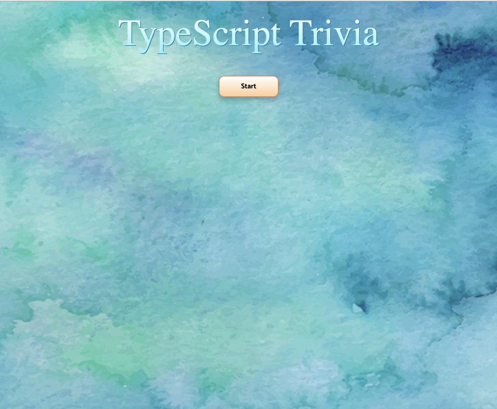
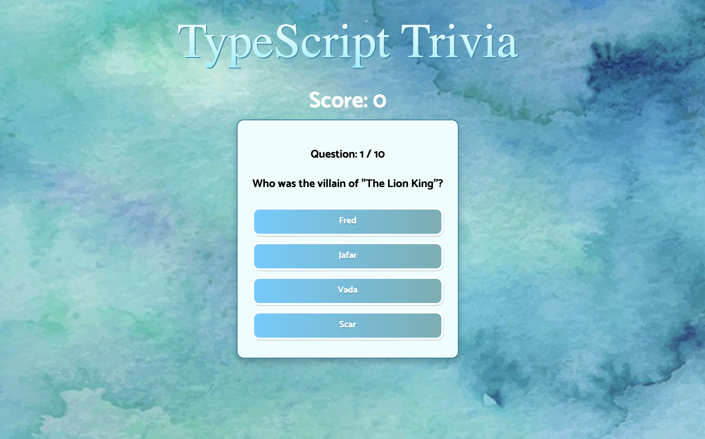
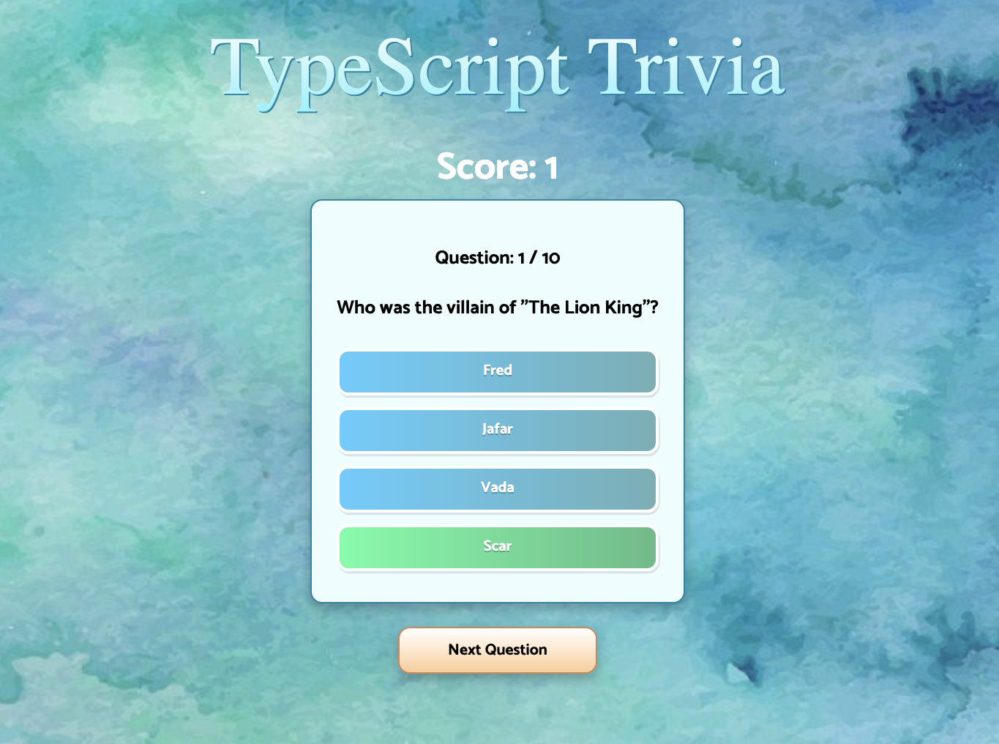

# TypeScript Trivia

#### The Stack
* TypeScript.Js
* React
* Open Trivia DB API
* Styled Components
* React Hooks

##### I really enjoyed creating this simple TypeScript.Js Trivia app, allowing myself to learn TypeScript.Js as well as learning more about API's, Styled Components, as well as React Hooks.

